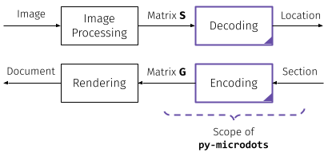

 [](https://doi.org/10.5281/zenodo.7361722)

# py-microdots

This repository provides **py-microdots**, a Python library for encoding and decoding 2D locations based on the [Anoto](https://www.anoto.com/cases/anoto-digital-pen/) dot pattern approach.

<div align="center">

</div>

The Anoto grid pattern encodes a unique 2D position for every possible 6x6 sub-array of dots. Assuming a grid resolution of 0.3 mm, this coding remains unique over the area of Europe and Asia. For clarity, the dots are significantly scaled up and nominal grid lines are shown.

## Paper

This implementation is based on my personal research on the Anoto coding. A detailed report is available [here](https://doi.org/10.5281/zenodo.7009235). Update 11/2022: The paper was accepted at the Computing Conference 2023.

## Features

**py-microdots** offers the following features

-   Decoding of position coordinates, section coordinates and pattern rotations.
-   Encoding support including section coordinates
-   Drawing routines
-   Generalized interface that supports tailored coding variants (e.g. 4x4 codes)

## Scope

The focus of this library is depicted in the following diagram

<div align="center">

</div>

**py-microdots** focuses on encoding and decoding of bit-matrices and does not come with image processing or plotting capabilites.

## Example

```python
# Import the library
import microdots as mdots

# Use the default embodiment with A4 sequence fixed (see paper)
codec = mdots.anoto_6x6_a4_fixed

# Generate a bit-matrix for section (10,2)
G = codec.encode_bitmatrix(shape=(9, 16), section=(10, 2))

# Render dots
import matplotlib.pyplot as plt

fig, ax = plt.subplots()
mdots.draw_dots(G, grid_size=1.0, show_grid=True, ax=ax)
fig.savefig("dots.pdf")
plt.close(fig)

# Decode a partial matrix
S = G[3 : 3 + 6, 7 : 7 + 6]

pos = codec.decode_position(S)
sec = codec.decode_section(S, pos=pos)

# To decode the rotation, use an extended matrix
R = G[3 : 3 + 8, 7 : 7 + 8]
rot = codec.decode_rotation(R)
print("pos:", pos, "sec:", sec, "rot:", rot)
# > pos: (7, 3) sec: (10, 2) rot: 0
```

## Cite

Please consider citing this work as

```
@unpublished{heindl_christoph_2022_7009235,
  author       = {Heindl, Christoph},
  title        = {py-microdots and the Anoto Codec},
  note         = {{See https://github.com/cheind/py-microdots for
                   additional information.}},
  month        = aug,
  year         = 2022,
  doi          = {10.5281/zenodo.7009235},
  url          = {https://doi.org/10.5281/zenodo.7009235}
}

@software{pymicrodots2022,
    author = {Heindl, Christoph},
    doi = {10.5281/zenodo.7009235},
    month = {8},
    title = {{py-microdots and the Anoto Codec}},
    version = {1.0.0},
    year = {2022},
}
```
